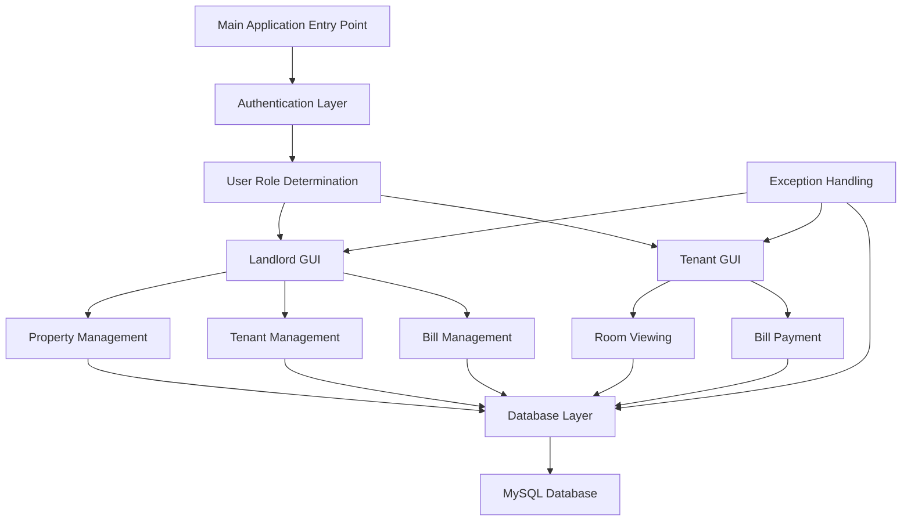

# Full Stack Room Rental Management System

A comprehensive Java-based desktop application for managing room rentals, built using Object-Oriented Programming (OOP) principles and featuring a complete full-stack architecture with GUI frontend and MySQL database backend.

## 🏢 Project Overview

This Room Rental Management System is designed to help landlords and property managers efficiently manage their rental properties, tenants, and billing operations. The application provides separate interfaces for landlords and tenants, enabling comprehensive property management and rental operations.

## ✨ Features

### 🏠 Property Management
- **Building Management**: Add, update, and manage multiple buildings
- **Floor Management**: Organize floors within buildings
- **Room Management**: Detailed room information including rent, availability status
- **Hierarchical Structure**: Buildings → Floors → Rooms organization

### 👥 User Management
- **Landlord Portal**: Complete property and tenant management
- **Tenant Portal**: View rental information and payment history
- **Authentication System**: Secure login for different user types
- **User Profiles**: Manage personal and contact information

### 💰 Billing & Payment System
- **Bill Generation**: Automated monthly rent bill creation
- **Payment Processing**: Record and track rent payments
- **Payment History**: Complete billing and payment records
- **Outstanding Balance**: Track unpaid amounts

### 🖥️ User Interface
- **Intuitive GUI**: Java Swing-based desktop interface
- **Role-based Access**: Different interfaces for landlords and tenants
- **Real-time Updates**: Dynamic data refresh and updates

## 🏗️ Architecture & OOP Implementation

This project demonstrates advanced Object-Oriented Programming concepts:

### **Encapsulation**
- Private data members with public getter/setter methods
- Data hiding in User, Room, Building, and other entity classes
- Controlled access to sensitive information

### **Inheritance**
- `User` base class extended by `Landlord` and `Tenant` classes
- Shared properties and methods inherited from parent classes
- Specialized behavior in derived classes

### **Polymorphism**
- Method overriding in user-specific implementations
- Interface-based programming with `Authentication` interface
- Runtime method resolution

### **Abstraction**
- Interface segregation with `Authentication` interface
- Abstract data access layer through DML classes
- Separation of concerns between GUI, business logic, and data layers

## 🛠️ Technology Stack

- **Language**: Java (JDK 8+)
- **GUI Framework**: Java Swing
- **Database**: MySQL
- **Database Connectivity**: JDBC (MySQL Connector/J 9.2.0)
- **IDE**: IntelliJ IDEA (project files included)
- **Architecture**: MVC Pattern with layered architecture

## 📁 Project Structure

```
FullStackRoomRentalManagementSystem/
├── DataBase/                               
│   ├── BillDML.java                          
│   ├── BillRecordDML.java  
│   ├── BuildingDML.java     
│   ├── FloorDML.java        
│   ├── RoomDML.java        
│   ├── TenantDML.java      
│   ├── LandlordDML.java     
│   └── DataBaseConnection.java 
├── GUI/                    
│   ├── LoginGUI.java        
│   ├── LandlordGUI.java     
│   ├── TenantGUI.java       
│   ├── RoomManagementGUI.java
│   ├── BuildingManagementGUI.java
│   ├── BillManagementGUI.java
│   └── ...
├── Users/                  
│   ├── User.java          
│   ├── Landlord.java      
│   └── Tenant.java        
├── Properties/            
│   ├── Building.java       
│   ├── Floor.java         
│   └── Room.java          
├── Payment/                
│   ├── Bill.java           
│   └── BillRecord.java    
├── Exceptions/             
│   ├── LandlordException.java
│   ├── TenantException.java
│   ├── RoomException.java
│   └── ...
├── Interface/             
│   └── Authentication.java  
├── Main/                    
│   ├── App.java           
│   └── Menu.java           
└── lib/                     
    └── mysql-connector-j-9.2.0.jar
```
## System Architecture Overview




## 🚀 Setup Instructions

### Prerequisites
- Java Development Kit (JDK 8 or higher)
- MySQL Server (5.7 or higher)
- MySQL Workbench (optional, for database management)

### Database Setup
1. Install and start MySQL Server
2. Create a new database for the application
3. Update database connection parameters in `DataBaseConnection.java`
4. Run the application to auto-create tables (or manually create using provided schema)

### Application Setup
1. Clone or download the project
2. Open the project in your preferred Java IDE
3. Add the MySQL connector JAR to your project classpath
4. Configure database connection settings
5. Compile and run `App.java`


## 💻 Usage

### For Landlords
1. **Login** with landlord credentials
2. **Manage Properties**: Add buildings, floors, and rooms
3. **Tenant Management**: Add/remove tenants, assign rooms
4. **Bill Management**: Generate monthly bills, track payments
5. **Reports**: View occupancy and payment reports

### For Tenants
1. **Login** with tenant credentials
2. **View Room Details**: Check room information and rent amount
3. **Payment History**: View all payment records
4. **Outstanding Bills**: Check pending payments

## 🎯 Key OOP Design Patterns Used

### **Data Access Object (DAO) Pattern**
- Separate DML classes for each entity
- Abstraction of database operations
- Clean separation between data access and business logic

### **Model-View-Controller (MVC)**
- **Model**: Entity classes (User, Room, Building, etc.)
- **View**: GUI classes for user interface
- **Controller**: Business logic and data manipulation

### **Factory Pattern**
- User creation based on user type
- Database connection management

### **Exception Handling**
- Custom exception classes for different scenarios
- Proper error handling and user feedback

## 🔧 Future Enhancements


- **Mobile App**: Develop companion mobile application
- **Advanced Reporting**: Add charts and analytics
- **Email Notifications**: Automated bill and payment reminders
- **Multi-language Support**: Internationalization features

## 🤝 Contributing

1. Fork the repository
2. Create a feature branch (`git checkout -b feature/AmazingFeature`)
3. Commit your changes (`git commit -m 'Add some AmazingFeature'`)
4. Push to the branch (`git push origin feature/AmazingFeature`)
5. Open a Pull Request

## 📄 License

This project is licensed under the MIT License - see the LICENSE file for details.

## 👨‍💻 Author

Developed as a demonstration of full-stack Java application development using Object-Oriented Programming principles.

## 📞 Support

For support and questions, please open an issue in the project repository.

---

**Note**: This is an educational project demonstrating OOP concepts, full-stack architecture, and Java desktop application development.
```

